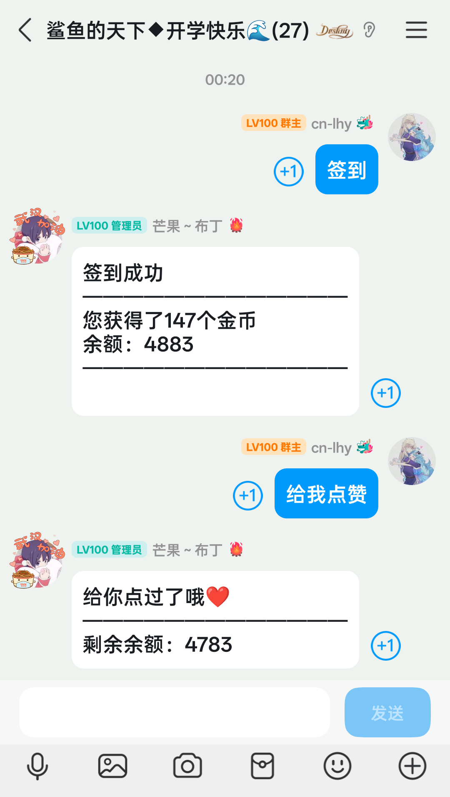
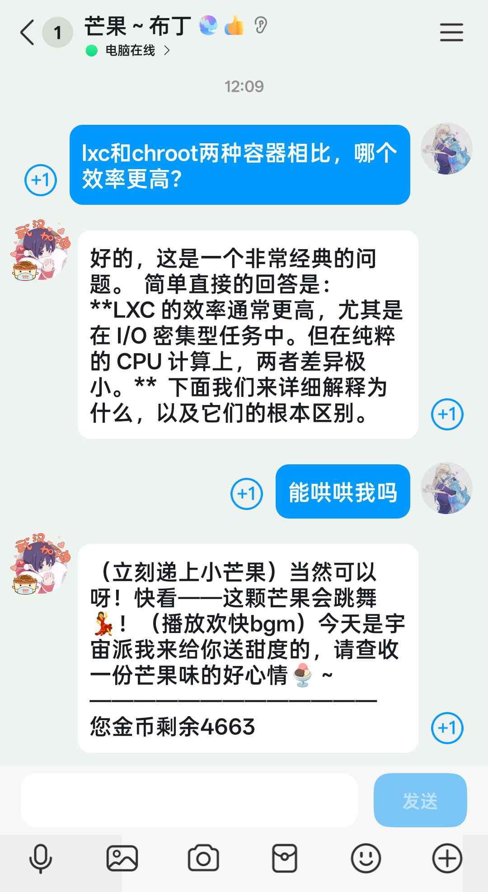

### 这是什么？
这是一个使用onebot11与Python构建的qq聊天机器人。它需要napcat机器人框架作为后端来使用。

onebot11项目地址:
https://dgithub.xyz/botuniverse/onebot-11/tree/master

napcat项目地址:
https://dgithub.xyz/NapNeko/NapCatQQ

napcat官方文档:
https://www.napcat.wiki/guide/start-install

### 使用示例：

图一是机器人给用户点名片赞，图二是机器人调用deepseek跟用户聊天。
